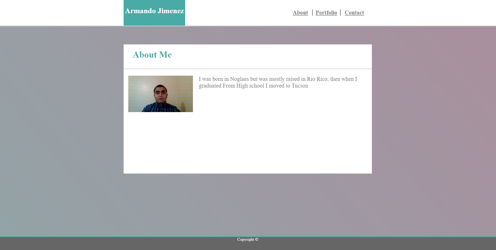

# responsive-portfolio

## Description: A Portfolio only using CSS and making it mobile resposivness

## How it is organaize:
### You click on the links on the top right to navigate through the pages

## How to run the app:
### 1. Git clone this repo
### 2. open index.html in your browser

### You can view the app here
### https://armjim14.github.io/responsive-portfolio/

## Home page

